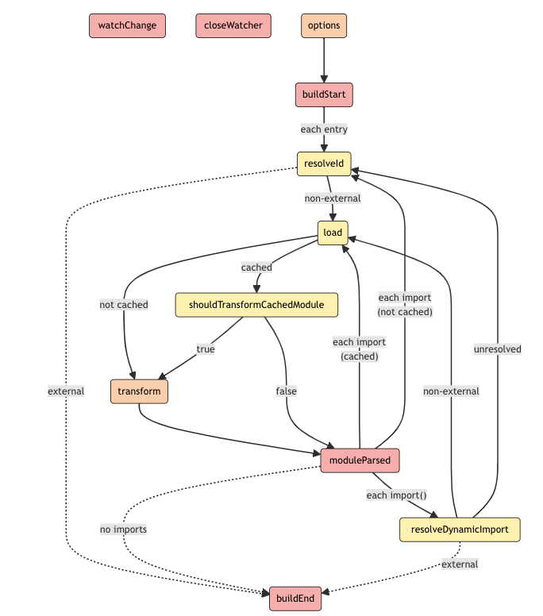

# rollup-plugin-copy-alias
a practice project of rollup-plugin


# Install 
Using pnpm:
```
pnpm install
```
# Usage
Create a rollup.config.js  configuration file and import the plugin:

```javaScript
import { defineConfig } from 'rollup';
import { alias } from 'alias'

export default defineConfig({
    input:'./index.js',
    output:{
        file:'./dist/index.js',
        format:'es'
    },
    plugins:[
        alias({
            entries:{
                "@":'./utils'
            }
        })
    ],
})
```

# Deppendency list
+ @rollup/plugin-typescript // ts plugin
+ rollup //打包工具
+ vitest //单元测试工具


# skill
example 是一个测试 alias 项目目录
怎么引入用 未发布的npm包，而是引用本地的 alias 包到 `node_module` 中
```
pnpm i ../ -D
``` 
exmaple 文件 => package.json => devDependencies 会出现 `"alias": "link:.."` 说明本地依赖包引用成功了

# vitest 单元测试
创建 `index.spec.ts` 文件
``` TypeScript
import { describe, it, expect } from 'vitest'
import { alias } from '.'

describe("alias", () => {

    describe("entries is Object", () => {
        it('shoule replace when match successful', () => {
            const aliasObj: any = alias({
                entries: {
                    "@": './utils'
                }
            })
            expect(aliasObj.resolveId('@/add')).toBe('./utils/add.js')
        });

        it('shoule replace when match fail', () => {
            const aliasObj: any = alias({
                entries: {
                    "@": './utils'
                }
            })

            expect(aliasObj.resolveId('!/add')).toBe('!/add')
        });
    })


    describe("entries is Array", () => {
        it('shoule replace when match successful',()=>{
            const aliasObj:any = alias({
                entries:[{
                    find:'@',
                    replacement:'./utils'
                }]
            }) 
            
            expect(aliasObj.resolveId('@/add')).toBe('./utils/add.js')
        });

        it("should replace when find is regular",()=>{
            const aliasObj:any = alias({
                entries:[{
                    find:'/^(.*)\.js$/',
                    replacement:'$1.alias'
                }]
            })
            expect(aliasObj.resolveId("add.js")).toBe("add.alias.js")
        })
    })

})
```


# [Rollup Plugin](https://rollupjs.org/plugin-development/#build-hooks)
Build Hooks



# Tip
- plugin 是一个函数，需要返回一个对象
- 程序 = 数据结构 + 算法